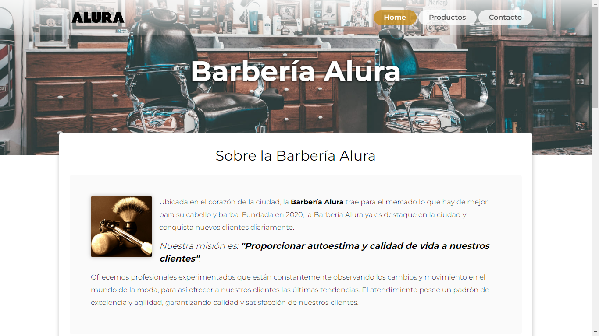

# Barberia alura

Esto es lo que se realizó en los módulos de HTML5/CSS3 (1,2,3 y 4), obviamente esta versión esta completamente modificada y le he agregado javascript, también contiene comentarios de donde obtuve dicha información para que ustedes puedan ver y saber más si quieren.

Lo he realizado de forma que no tiene que recargar la página para navegar.

Barbería Alura v1.0

El resultado del mismo

Lo malo:
Google Map: Este genera algunos problemas, por lo cual investigraré más para realizarlo con la api key y que funcione perfectamente.

Video de Youtube: Existe un plugin de javascript que hace que se cargue el iframe solo cuando el usuario de play para reproducir el video.

### Otros repositorios
 * 🗄 [Encriptador v2](https://github.com/joelmiguelvalente/encriptador/tree/main)
 * 🗄 [Encriptador v3](https://github.com/joelmiguelvalente/encriptador)
 * 🗄 [Ahorcado v2](https://github.com/joelmiguelvalente/ahorcadov2)